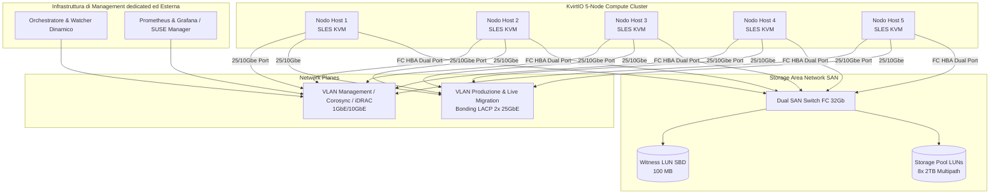

# KvirtIO: High-Level Design
**Enterprise Virtualization Platform for High-Throughput Service Providers**

---

## 1. Executive Summary & Obiettivi del Progetto

### 1.1 Introduzione e Visione
Il progetto **KvirtIO** definisce l'architettura di una piattaforma di virtualizzazione di classe Enterprise concepita per scenari ad elevatissima densità di I/O e alta affidabilità (HA), destinata a ospitare carichi di lavoro mission-critical (es. Database transazionali, ERP ad alto throughput, sistemi di messaggistica ad alta frequenza). 

A differenza delle soluzioni di virtualizzazione commerciali tradizionali, KvirtIO adotta uno stack tecnologico interamente basato su componenti nativi e open-source di livello enterprise distribuiti da **SUSE Linux Enterprise Server (SLES) 15 SP5/SP6**, garantendo il controllo completo sul piano dati (data plane) e sul piano di controllo (control plane), l'assenza di vendor lock-in e prestazioni vicino al bare-metal grazie a una rigorosa ottimizzazione hardware-software.



### 1.2 Obiettivi Chiave del Progetto
*   **Zero Resource Contention (No Overcommit & No Swap)**: Allocazione deterministica delle risorse fisiche (RAM e CPU) per prevenire fenomeni di "noisy neighbor" e garantire tempi di risposta ultra-bassi e predicibili.
*   **I/O Parallelism**: Ottimizzazione del percorso dati dallo ipervisore allo storage su SAN Fibre Channel a 32Gb, superando i limiti tradizionali delle code SCSI (`lun_queue_depth`) tramite segmentazione logica e blk-mq.
*   **Dual-Level Fencing deterministico**: Prevenzione assoluta di split-brain e corruzione dei dati sui volumi condivisi mediante politiche STONITH multilivello fisiche e storage-based.
*   **Disaccoppiamento del Piano di Controllo**: Isolamento delle logiche di monitoraggio, telemetria e bilanciamento dei carichi all'esterno del cluster di calcolo (Compute Cluster) per preservare la stabilità degli host ipervisori.

---

## 2. Architettura dei Nodi (Compute)

Il cluster KvirtIO è composto da **5 nodi fisici omogenei** configurati con SUSE Linux Enterprise Server (SLES) ottimizzato per il ruolo di KVM Hypervisor.

### 2.1 Profilo Hardware Consigliato per Nodo
Per garantire l'omogeneità e supportare la live migration senza degradamento delle prestazioni, ciascun nodo adotta la seguente configurazione:
*   **CPU**: Dual Socket Intel Xeon Scalable Platinum o AMD EPYC ad alto numero di core (es. AMD EPYC 9354, 32 core, 3.25GHz).
*   **RAM**: 1TB o 2TB DDR5 ECC Registered.
*   **HBA**: Emulex o QLogic Dual-Port Fibre Channel a 32Gb.
*   **NIC**: Dual-Port 25GbE SFP28 per il traffico di produzione e live migration; Dual-Port 10GbE RJ45 per il management ed il cluster heartbeat.
*   **Out-of-Band**: Dell iDRAC9 Enterprise (o equivalente HPE iLO 6) con interfaccia di rete dedicata da 1GbE.

### 2.2 Requisito Critico SWAP: Zero Swap Policy (vm.swappiness = 0)
Nei sistemi di virtualizzazione enterprise operanti con carichi di tipo "IOIntensive" (come database transazionali), la latenza indotta dall'accesso al disco per il paging della memoria host è distruttiva. Se l'host rimette in swap porzioni di RAM appartenenti a una macchina virtuale, il sistema guest subirà un blocco temporaneo o un drop improvviso del throughput di I/O, spesso interpretato dalle applicazioni come un crash.

Per questo motivo, l'architettura KvirtIO stabilisce la **disabilitazione totale della partizione di swap** su tutti i nodi hypervisor.

#### Configurazione e Hardening sul Kernel SLES
Durante la fase di installazione del sistema operativo SLES:
1.  **Esclusione della partizione**: Non viene creata alcuna partizione di swap nei dischi locali dell'host (solitamente configurati in RAID 1 hardware su due SSD/NVMe per il solo OS).
2.  **Rimozione da `/etc/fstab`**: Qualora presente, ogni riferimento a swap deve essere rimosso.
3.  **Tuning dei parametri del Kernel (`sysctl`)**:
    Creare il file `/etc/sysctl.d/99-kvirtio-memory.conf` con i seguenti parametri:
    ```ini
    # Disabilita l'aggressività del paging a favore del memory reclaim
    vm.swappiness = 0
    
    # Impedisce l'overcommit selvaggio della memoria, assicurando allocazioni reali
    vm.overcommit_memory = 2
    vm.overcommit_ratio = 90
    
    # Forza il panic del kernel in caso di esaurimento memoria (OOM) anziché killing casuale dei processi QEMU
    vm.panic_on_oom = 1
    kernel.panic = 10
    ```
4.  **Disabilitazione a caldo**:
    ```bash
    swapoff -a
    ```

### 2.3 Componenti Software Nativi SLES per la Virtualizzazione
Il layer di virtualizzazione poggia sui pacchetti nativi del canale SLES Virtualization:
*   **KVM (Kernel-based Virtual Machine)**: Modulo del kernel Linux (`kvm_intel` o `kvm_amd`) che trasforma il kernel in un hypervisor di Tipo 1.
*   **QEMU (Quick Emulator)**: Versione ottimizzata per SLES (`qemu-kvm` o `qemu-system-x86_64`) per l'emulazione dell'hardware e l'esecuzione del codice guest in accelerazione hardware tramite `/dev/kvm`.
*   **Libvirt**: Il demone di management (`libvirtd.service`) e la suite di strumenti associati (`virsh`, API XML) per la gestione del ciclo di vita delle VM.

#### Tuning Libvirt/QEMU per VM IOIntensive
La definizione XML delle macchine virtuali su KvirtIO deve prevedere l'ottimizzazione del controller dei dischi e della memoria tramite Hugepages:

```xml
<domain type='kvm'>
  <name>kvirtio-vm-db01</name>
  <memory unit='KiB'>268435456</memory> <!-- 256 GB -->
  <currentMemory unit='KiB'>268435456</currentMemory>
  <memoryBacking>
    <!-- Utilizzo obbligatorio di Hugepages da 1GB statiche pre-allocate sull'host -->
    <hugepages>
      <page size='1048576' unit='KiB'/>
    </hugepages>
    <locked/>
  </memoryBacking>
  <vcpu placement='static'>32</vcpu>
  <cpu mode='host-passthrough'>
    <topology sockets='2' dies='1' cores='16' threads='1'/>
    <numa>
      <cell id='0' cpus='0-15' memory='134217728' unit='KiB' memAccess='shared'/>
      <cell id='1' cpus='16-31' memory='134217728' unit='KiB' memAccess='shared'/>
    </numa>
  </cpu>
  <devices>
    <!-- Controller SCSI ottimizzato con multiqueue abilitato -->
    <controller type='scsi' index='0' model='virtio-scsi'>
      <driver queues='32' iothread='1'/>
    </controller>
    <!-- Configurazione del disco basata su lvmlockd (vedere Sezione 3) -->
    <disk type='block' device='disk'>
      <driver name='qemu' type='raw' cache='none' io='native' discard='unmap'/>
      <source dev='/dev/vg_iointensive/lv_vm_db01'/>
      <target dev='sda' bus='scsi'/>
      <address type='drive' controller='0' bus='0' target='0' unit='0'/>
    </disk>
  </devices>
</domain>
```

---

## 3. Storage Topology & I/O Optimization

I carichi "IOIntensive" necessitano di un'infrastruttura storage con bassa latenza di transito ed elevata capacità di IOPS paralleli. L'architettura KvirtIO si attesta su una **SAN Fibre Channel (FC) a 32Gb** in modalità completamente ridondata.

### 3.1 Il Limite della Code di I/O (lun_queue_depth)
Nei sistemi operativi Linux, ogni dispositivo a blocchi scansionato dal kernel (inclusi i path multipath mappati dalle LUN esterne) ha una coda di I/O gestita dal driver SCSI. Il parametro `lun_queue_depth` (solitamente impostato a 32 o 64 a seconda dell'HBA) determina quante richieste di I/O concorrenti possono essere inviate a quella specifica LUN prima che il kernel inizi ad accodare le successive in memoria a livello di OS host.

Se si associa un'unica grande LUN (es. 16TB) a una macchina virtuale database ad alto carico, tutti gli IO thread della VM concorreranno sulla medesima coda SCSI singola. Questo crea un **collo di bottiglia sistemico** a livello di driver host (HBA), saturando la profondità di coda anche se lo storage array sottostante ha ancora bandwidth fisica disponibile.

### 3.2 Strategia Multi-LUN & blk-mq Stripe
Per superare questo limite, KvirtIO impone una configurazione in cui ogni macchina virtuale con profilo "IOIntensive" poggia su un **Logical Volume (LV) distribuito (striped) su un minimo di 8 LUN fisiche separate**.

#### Esempio Architetturale: Allocazione da 16TB per VM
Invece di presentare una LUN da 16TB, lo Storage Administrator alloca **8 LUN da 2TB ciascuna** sulla SAN FC.
*   Ogni singola LUN possiede la propria coda SCSI indipendente a livello di kernel dell'host SLES.
*   Si ottiene così una profondità di coda complessiva pari a $8 \times$ `lun_queue_depth` della singola LUN (es. $8 \times 64 = 512$ comandi in parallelo).
*   Il kernel di SLES, sfruttando il sottosistema multiqueue block layer (**blk-mq**), distribuisce il carico di computazione delle code di I/O su core CPU differenti, eliminando i lock software interni all'host.

```
                  +-------------------------------------------------+
                  |                Virtual Machine                  |
                  |         (Guest OS - Write/Read IOPS)             |
                  +-------------------------------------------------+
                                           |  (virtio-scsi MultiQueue)
                                           v
                  +-------------------------------------------------+
                  |       Logical Volume Striped (LVM) su Host      |
                  |           /dev/vg_iointensive/lv_vm_db01        |
                  +-------------------------------------------------+
                     /       /       /     |     \       \       \
                    /       /       /      |      \       \       \
                   v       v       v       v       v       v       v
                 [LUN1]  [LUN2]  [LUN3]  [LUN4]  [LUN5]  [LUN6]  [LUN7]  [LUN8] (Ogni LUN = 2TB)
                 Depth64 Depth64 Depth64 Depth64 Depth64 Depth64 Depth64 Depth64
                   |       |       |       |       |       |       |       |
                   +-------+-------+-------+-------+-------+-------+-------+--> [SAN 32Gb FC]
                                           Total Queue Depth = 512
```

### 3.3 Gestione dei Volumi Condivisi: Cluster LVM (lvmlockd & dlm)
Poiché le macchine virtuali devono poter migrare a caldo da un nodo all'altro, tutti i nodi del cluster devono vedere contemporaneamente le LUN di storage. Tuttavia, l'accesso simultaneo incontrollato a un Volume Group (VG) LVM da parte di più host causerebbe la corruzione immediata dei metadati LVM.

KvirtIO adotta **lvmlockd** (LVM lock daemon) integrato con il **DLM (Distributed Lock Manager)** di SLES. Questo stack sostituisce il vecchio demone `clvmd`.

#### Funzionamento del Blocco dei Volumi
1.  **DLM**: Gestisce il coordinamento dei lock tra i nodi via rete attraverso il cluster manager Pacemaker/Corosync.
2.  **lvmlockd**: Riceve le richieste di allocazione o modifica di metadati LVM e le convalida tramite DLM.
3.  Quando una VM viene avviata sul Nodo 1, `lvmlockd` acquisisce un lock esclusivo (write lock) sul Logical Volume della VM. Gli altri nodi possono vedere il volume ma non possono scrivervi nè avviarlo, garantendo la sicurezza.
4.  Durante la Live Migration, il lock viene rilasciato in modo atomico dal Nodo 1 e acquisito dal Nodo 2, coordinato da Pacemaker.

#### Workflow di configurazione dello Storage su Host SLES
1.  **Inizializzazione di DLM**: Assicurarsi che il servizio DLM sia integrato nel cluster Pacemaker.
2.  **Configurazione di LVM**: Abilitare `locking_type = 1` ed impostare `use_lvmlockd = 1` in `/etc/lvm/lvm.conf`.
3.  **Creazione dei Physical Volumes (PV)** sulle 8 LUN multipath (es. `/dev/mapper/mpatha` fino a `/dev/mapper/mpathh`):
    ```bash
    pvcreate /dev/mapper/mpatha /dev/mapper/mpathb /dev/mapper/mpathc /dev/mapper/mpathd \
             /dev/mapper/mpathe /dev/mapper/mpathf /dev/mapper/mpathg /dev/mapper/mpathh
    ```
4.  **Creazione del Volume Group di Cluster**:
    Si utilizza il flag `--lock-type dlm` per indicare a LVM di delegare i lock al cluster:
    ```bash
    vgcreate --lock-type dlm vg_iointensive \
             /dev/mapper/mpatha /dev/mapper/mpathb /dev/mapper/mpathc /dev/mapper/mpathd \
             /dev/mapper/mpathe /dev/mapper/mpathf /dev/mapper/mpathg /dev/mapper/mpathh
    ```
5.  **Creazione del Logical Volume Striped**:
    Si crea il Logical Volume distribuendo i blocchi su tutti gli 8 PV fisici per massimizzare il parallelismo delle code:
    ```bash
    lvcreate -i 8 -I 64k -n lv_vm_db01 -L 16T vg_iointensive
    ```
    *   `-i 8`: Numero di stripes (coincide con il numero di LUN/PV).
    *   `-I 64k`: Dimensione dello stripe unit (64 KB ottimale per la maggior parte dei DB relazionali).

---

## 4. High Availability, Fencing & Quorum (STONITH)

L'alta affidabilità del cluster KvirtIO a 5 nodi è interamente orchestrata dallo stack **High Availability Enterprise Extension** di SLES, basato su Pacemaker (il cluster manager) e Corosync (il motore di comunicazione interna).

### 4.1 Pacemaker & Corosync
*   **Corosync**: Gestisce la messaggistica a bassa latenza (heartbeat) tra i nodi e rileva la perdita di connettività. Nel cluster KvirtIO a 5 nodi, il quorum minimo richiesto per il corretto funzionamento è di **3 nodi attivi** ($\text{Quorum} = \lfloor N/2 \rfloor + 1$).
*   **Pacemaker**: Monitora costantemente lo stato dei nodi e delle risorse virtuali (le VM definite tramite resource agent `ocf:heartbeat:VirtualDomain`). In caso di fallimento hardware di un nodo, Pacemaker decide su quale dei nodi rimanenti riavviare le VM affette.

### 4.2 Configurazione del Fencing Multilivello (STONITH)
Nelle architetture di storage condiviso (SAN FC) con LVM clusterizzato, il peggior scenario immaginabile è la perdita di connettività di rete di un nodo senza che questo si spenga (scenario di split-brain). Se due nodi pensano di essere gli unici sopravvissuti e tentano di scrivere contemporaneamente sullo stesso Logical Volume, si verifica una **corruzione irreversibile del filesystem o del database**.

Per prevenire questo scenario, Pacemaker impone il meccanismo **STONITH (Shoot The Other Node In The Head)**. L'architettura KvirtIO implementa un sistema a **due livelli indipendenti**, garantendo che un nodo non responsivo venga isolato fisicamente ed elettricamente prima che le sue VM vengano avviate altrove.

```
                        +---------------------------+
                        |      Nodo da Fencare      |
                        +---------------------------+
                                      |
              +-----------------------+-----------------------+
              |                                               |
              v (Livello 1: Rete Out-of-Band)                v (Livello 2: Witness SAN)
     +-----------------+                             +-----------------+
     |   fence_idrac   |                             |    SBD Daemon   |
     +-----------------+                             +-----------------+
              |                                               |
              | (Comando IPMI/OOB)                            | (Mancato Heartbeat/Mailbox)
              v                                               v
     [Spegni Chassis]                                [Watchdog Hardware]
              |                                               |
              +-----------------------+-----------------------+
                                      |
                                      v
                             [Nodo Off/Reset]
```

#### Livello A: Fencing Fisico (fence_idrac)
*   **Agente**: `fence_idrac` (basato su protocollo Redfish o IPMI su rete out-of-band).
*   **Funzionamento**: In caso di mancata risposta del nodo tramite Corosync, Pacemaker invia un comando diretto alla scheda iDRAC del nodo target per richiedere un **hard reset elettrico immediato (poweroff / powercycle)**.
*   Questa operazione garantisce la disattivazione del nodo a livello hardware.

#### Livello B: Fencing di Storage / Witness (SBD - Storage-based Death)
In caso di parziale fallimento della rete di management che renda impossibile contattare sia l'host sia la scheda iDRAC, entra in funzione il meccanismo **SBD**.
*   **Witness LUN**: Viene creata una LUN dedicata da **100MB** sulla SAN Fibre Channel (condivisa tra tutti e 5 i nodi). Questa LUN non ospita filesystem ed è inizializzata per l'uso esclusivo di SBD.
*   **Watchdog Hardware**: Ogni nodo deve avere un modulo watchdog di sistema attivo a livello kernel (es. `iTCO_wdt` per hardware Intel o `/dev/watchdog`).
*   **Funzionamento**:
    1.  Il demone `sbd` in esecuzione su ciascun host scrive costantemente un heartbeat sulla LUN condivisa e interroga la propria "mailbox" riservata sulla stessa LUN.
    2.  Se Pacemaker stabilisce che il Nodo 3 è isolato e non è raggiungibile via rete, scrive un messaggio di "fencing target" nella mailbox del Nodo 3 presente sulla LUN SBD.
    3.  Il demone `sbd` del Nodo 3 legge il messaggio di fencing sulla LUN (poiché il percorso FC a 32Gb è ancora attivo) ed esegue un **suicidio immediato del nodo** tramite il reset hardware controllato dal watchdog Linux, bypassando totalmente la rete IP e lo stack software di spegnimento.
    4.  Se il demone `sbd` smette di scrivere o si blocca, il watchdog hardware non riceve più il segnale di "keep-alive" e riavvia forzatamente la macchina fisica dopo pochi secondi.

### 4.3 Divieto di Script Custom
È severamente vietato l'utilizzo di script custom o meccanismi applicativi operanti a livello di guest (es. ping all'interno della VM, agenti software all'interno del sistema operativo guest) per scatenare il fencing o la migrazione forzata degli host. I motivi ingegneristici sono:
*   **Cascading Failures**: Un blocco della rete a livello VM (es. disservizio su uno switch di produzione guest) non riflette necessariamente un problema di salute dell'host hypervisor. Eseguire il fencing dell'host causerebbe il riavvio non necessario di tutte le altre VM sane ospitate sullo stesso nodo.
*   **False Positività**: L'elevato carico applicativo all'interno di una VM potrebbe ritardare le risposte di uno script di monitoraggio custom, generando falsi positivi con conseguenti reboot ciclici (fencing loops).
*   **Inconsistenza dello Stato**: Solo il cluster manager (Pacemaker) possiede la visione globale dello stato delle risorse e della topologia dello storage condiviso. Solo Pacemaker può decidere in modo sicuro e coordinato l'isolamento di un nodo.

---

## 5. Control Plane & Orchestrazione Esterna

Il principio cardine del design di KvirtIO è la **separazione dei piani**. Gli host ipervisori devono dedicare i propri cicli CPU, la memoria e l'I/O storage esclusivamente alla computazione delle macchine virtuali dei clienti.

### 5.1 Esternalizzazione del Control Plane e dei Watcher
Tutti i componenti software non critici per l'esecuzione diretta del piano dati (data plane) devono risiedere su un'infrastruttura di gestione (Management Plane) fisicamente ed logicamente disaccoppiata:
*   **Monitoring e Log Collection**: I demoni di esportazione delle metriche (es. `prometheus-node-exporter`, `libvirt-exporter`) girano sugli host KVM con priorità CPU minima (`nice` impostato a valori alti) e inviano i dati a un cluster Prometheus/Grafana esterno.
*   **Dynamic Balancer & Capacity Management**: Eventuali script di analisi predittiva del carico o demoni incaricati del bilanciamento dinamico delle risorse (es. DRS custom che richiama le API di live migration via `virsh` in base all'uso della CPU host) devono essere eseguiti all'esterno del cluster KVM (su VM o server dedicati alla gestione). Tali watcher interrogano l'API di `libvirt` da remoto (tramite connessione cifrata TLS) ed effettuano le chiamate necessarie senza gravare sul kernel degli host ipervisori.

### 5.2 Topologia e Segregazione della Rete
La rete del cluster KvirtIO è strutturata per isolare rigidamente i flussi di traffico su interfacce fisiche e logiche (VLAN) separate.

#### Schema Logico delle Connessioni di Rete per Nodo
```
                         +-----------------------------------+
                         |             Nodo Host             |
                         +-----------------------------------+
                           /                               \
        (Dual 10GbE PCI-e) /                                 \ (Dual 25GbE LACP Bond)
                          /                                   \
  +--------------------------------+                 +--------------------------------+
  |  Int. Fisiche: eth0 / eth1     |                 |   Int. Fisiche: ens1 / ens2    |
  +--------------------------------+                 +--------------------------------+
     |             |             |                      |                          |
     v             v             v                      v                          v
  [VLAN 10]     [VLAN 11]     [OOB IP]               [VLAN 20]                  [VLAN 30+]
  Management   Corosync HB     iDRAC                  Live Migration             VM Prod Traffic
  (SSH/API)    (Multicast)   (Fencing)               (Senza Limiti)             (VLAN Trunking)
```

1.  **Management / Cluster Network (Dual 10GbE / Interfacce Fisiche Separate)**:
    *   **VLAN 10 - Management**: Traffico per l'amministrazione remota via SSH, chiamate API `libvirt` e monitoraggio.
    *   **VLAN 11 - Corosync Heartbeat**: Canale a bassissima latenza dedicato esclusivamente alla messaggistica del cluster. I pacchetti Corosync devono avere la priorità massima ed essere configurati con QoS/CoS dedicati a livello di switch fisici.
    *   **Rete OOB (iDRAC)**: Rete cablata fisicamente separata (su switch dedicati alla gestione dell'infrastruttura hardware) per l'accesso protetto alle schede iDRAC dei 5 nodi fisici e per l'instradamento dei comandi di STONITH `fence_idrac`.

2.  **Produzione & Live Migration Plane (Dual 25GbE SFP28 in Bonding)**:
    *   Le due interfacce a 25GbE sono configurate in **LACP Bonding (Mode 4)** a livello di sistema operativo host (usando il modulo del kernel `bonding` di SLES) per garantire ridondanza e aggregazione di banda.
    *   La configurazione del link aggregation utilizza la politica di hashing L3+L4 (`xmit_hash_policy = layer3+4`) per ottimizzare la distribuzione dei flussi di rete TCP.
    *   Sul bond logico vengono attestate due tipologie di traffico tramite tag VLAN:
        *   **VLAN 20 - Live Migration**: Dedicata esclusivamente al transito della memoria RAM delle macchine virtuali durante i processi di migrazione a caldo tra gli host. Questa rete richiede il massimo throughput disponibile senza cap software, per completare il trasferimento delle pagine di memoria nel minor tempo possibile ed evitare il degrado delle performance della VM durante il "dirtying phase".
        *   **VLAN 30+ - VM Production**: VLAN trunked passate direttamente all'interno delle macchine virtuali tramite switch virtuali dell'host (es. Linux Bridges o Open vSwitch) per consentire la connettività di rete dei servizi applicativi forniti dalle VM.

---

## 6. Matrice delle Scelte Architetturali e Motivazioni Ingegneristiche

| Componente | Scelta Tecnologica | Alternativa Esclusa | Motivazione Ingegneristica |
| :--- | :--- | :--- | :--- |
| **Ipervisore** | KVM Nativo (SLES) | VMware ESXi / Hyper-V | Controllo completo dello stack Linux, riduzione dei costi di licenza, integrazione diretta con il kernel SLES Enterprise e facilità di automazione via API Libvirt. |
| **Gestione Swap** | Disabilitata staticamente + `vm.swappiness=0` | Swap attiva su disco veloce (SSD) | Eliminazione del rischio di latenze spurie indotte dall'host che effettua il paging della memoria allocata alle macchine virtuali. La RAM deve essere deterministica. |
| **Topologia Storage** | Multi-LUN Striped (8 LUN da 2TB per VM da 16TB) | LUN Singola da 16TB | Parallelizzazione delle code a livello di kernel host. Si passa da una queue depth singola (es. 64) ad una coda aggregata multipath (512) sfruttando blk-mq. |
| **Volume Locking** | `lvmlockd` + `dlm` | Legacy `clvmd` | Maggiore resilienza, migliore gestione dei cluster Pacemaker moderni, eliminazione del single-point-of-failure di clvmd in caso di freeze del cluster. |
| **Fencing Livello 1** | `fence_idrac` (OOB) | Fencing via rete VM | Garantisce il reset elettrico pulito del nodo a livello hardware, indipendentemente dallo stato del sistema operativo host. |
| **Fencing Livello 2** | SBD (Witness LUN + Watchdog) | Script di ping di rete | Offre un canale di quorum e auto-isolamento (suicidio dell'host) tramite hardware watchdog operante direttamente sul bus storage SAN FC, immune a guasti di rete IP. |
| **Rete Live Migration** | Rete dedicata 2x25GbE Bonded | Condivisione con la rete di Management | Previene la saturazione dei canali di comunicazione del cluster (Corosync) durante il trasferimento massivo della RAM di VM di grandi dimensioni (256GB+), riducendo la durata del blocco transitorio (downtime della migrazione). |


