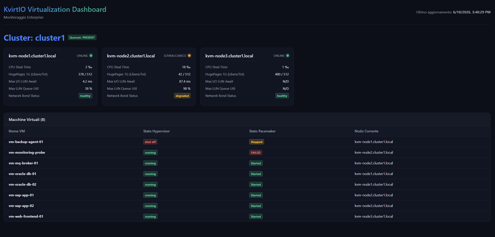

# KvirtIO: Enterprise Virtualization Platform

**KvirtIO** è un'architettura di virtualizzazione enterprise di classe Service Provider concepita per scenari ad elevata densità di I/O e alta affidabilità (HA), basata interamente su tecnologie native e open-source appoggiata su  **SUSE Linux Enterprise Server (SLES)**, non intendiamo **KvirtIO** come un hypervisor nativo, ma come già detto un architettura composta da soluzioni open-source.

Questo progetto non è in alcun modo legato alla libreria virtio.

---

## 🚀 Obiettivi del Progetto
*   **Prestazioni deterministiche**: Esclusione totale dello swap host e ottimizzazione dell'allocazione di RAM (Hugepages) e CPU (pinning NUMA).
*   **I/O ottimizzato per Database ("IOIntensive")**: Parallelizzazione delle code SCSI del kernel (`lun_queue_depth`) tramite strategie Multi-LUN Striped e architettura `blk-mq`.
*   **Alta Affidabilità e Fencing multilivello**: Integrazione stretta tra Pacemaker, Corosync, Cluster LVM (`lvmlockd` + `dlm`) e meccanismi STONITH fisici (`fence_idrac`) e storage-based (`sbd` su Witness LUN con watchdog hardware).
*   **Disaccoppiamento del Control Plane**: Isolamento delle logiche di monitoraggio, telemetria e bilanciamento dei carichi all'esterno del cluster KVM di produzione.

---

## 🎯 Quando usare KvirtIO

| Scenario | Adeguatezza |
|---|---|
| Cluster VM Enterprise | Eccellente |
| SAP / DB | Eccellente |
| Private Cloud | Moderata |
| Piattaforma Kubernetes | Non obiettivo primario |
| VDI | Moderata |
| Edge | Buona |

---

## 🧩 Matrice dei Profili Hardware VM

| Caratteristica | Generic | App | Database |
|---|---|---|---|
| CPU | Auto | Auto | Static |
| NUMA | Auto | Auto | Static |
| HugePages | No | 2M | 1G |
| Ballooning | Sì | Opzionale | No |
| Migration | Full | Full | Condizionata |

---

## 📂 Struttura del Repository

### 1. Documenti di Architettura e Design
*   📄 **[KvirtIO High-Level Design (HLD)](KvirtIO_HLD_IT.md)**: Il documento di architettura di alto livello in italiano.

### 2. Monitoraggio, Watcher & Gestione (Control Plane Esterno)
Questi script risiedono sul server di management esterno ed interrogano i nodi KVM tramite l'utente `kvirtwatch` via SSH.
*   📜 **[kvirtio-cluster-watcher.sh](scripts/kvirtio-cluster-watcher.sh)**: Watcher dello stato del cluster Pacemaker/Corosync e del fencing.
*   📜 **[kvirtio-console-tracker.sh](scripts/kvirtio-console-tracker.sh)**: Demone per l'allineamento dei token Websockify per console noVNC.
*   📜 **[kvirtio-host-watcher.sh](scripts/kvirtio-host-watcher.sh)**: Script di monitoraggio del carico CPU/RAM con integrazione `crm_attribute`.
*   📜 **[kvirtio-html-generator.py](scripts/kvirtio-html-generator.py)**: Script Python per compilare le metriche nel dashboard HTML.
*   📜 **[kvirtio-io-watcher.sh](scripts/kvirtio-io-watcher.sh)**: Script per l'analisi della latenza `await` sui dischi multipath.
*   📜 **[kvirtio-json-indexer.sh](scripts/kvirtio-json-indexer.sh)**: Helper per la compilazione dell'indice JSON dei file di stato.
*   📜 **[kvirtio-log-collector.py](scripts/kvirtio-log-collector.py)**: Raccoglitore centralizzato dei log di KvirtIO da journalctl a JSON.
*   📜 **[kvirtio-mail-alerter.py](scripts/kvirtio-mail-alerter.py)**: Notificatore SMTP asincrono per l'invio degli allarmi.
*   📜 **[kvirtio-multipath-watcher.sh](scripts/kvirtio-multipath-watcher.sh)**: Watcher per la verifica dei percorsi FC multipath.
*   📜 **[kvirtio-network-watcher.sh](scripts/kvirtio-network-watcher.sh)**: Watcher delle interfacce bond e della larghezza di banda.
*   📜 **[kvirtio-setup-rsyslog-generator.sh](scripts/kvirtio-setup-rsyslog-generator.sh)**: Generatore delle regole di ricezione rsyslog per i nodi.
*   📜 **[kvirtio-vm-create.sh](scripts/kvirtio-vm-create.sh)**: Script di provisioning di nuove VM con ottimizzazioni hardware.
*   📜 **[kvirtio-vm-migrate.sh](scripts/kvirtio-vm-migrate.sh)**: Script per la Live Migration a caldo di una VM.
*   📜 **[kvirtio-vm-watcher.sh](scripts/kvirtio-vm-watcher.sh)**: Watcher per la correlazione dello stato VM tra Libvirt e Pacemaker.

### 3. Configurazioni Systemd (Servizi & Timer)
*   ⚙️ **[kvirtio-cluster-watcher.service](systemd/kvirtio-cluster-watcher.service)** / **[Timer](systemd/kvirtio-cluster-watcher.timer)**: Esecuzione del watcher di cluster ogni 60 secondi.
*   ⚙️ **[kvirtio-console-tracker.service](systemd/kvirtio-console-tracker.service)**: Demone persistente per tracciare le console noVNC.
*   ⚙️ **[kvirtio-host-watcher.service](systemd/kvirtio-host-watcher.service)** / **[Timer](systemd/kvirtio-host-watcher.timer)**: Esecuzione del watcher host ogni 5 minuti.
*   ⚙️ **[kvirtio-html-generator.service](systemd/kvirtio-html-generator.service)** / **[Timer](systemd/kvirtio-html-generator.timer)**: Esecuzione del generatore HTML ogni 5 minuti.
*   ⚙️ **[kvirtio-io-watcher.service](systemd/kvirtio-io-watcher.service)** / **[Timer](systemd/kvirtio-io-watcher.timer)**: Esecuzione del watcher I/O ogni minuto.
*   ⚙️ **[kvirtio-log-collector.service](systemd/kvirtio-log-collector.service)**: Demone persistente per la raccolta e aggregazione dei log.
*   ⚙️ **[kvirtio-multipath-watcher.service](systemd/kvirtio-multipath-watcher.service)** / **[Timer](systemd/kvirtio-multipath-watcher.timer)**: Esecuzione del watcher multipath ogni 2 minuti.
*   ⚙️ **[kvirtio-vm-watcher.service](systemd/kvirtio-vm-watcher.service)** / **[Timer](systemd/kvirtio-vm-watcher.timer)**: Esecuzione del watcher VM ogni 2 minuti.

### 4. Modelli di Sicurezza e Configurazione
*   🛡️ **[kvirtwatch (Sudoers)](sudoers/kvirtwatch)**: Privilegi sudo minimi necessari da configurare sui nodi KVM.
*   ⚙️ **[mail.conf](etc/kvirtio/mail.conf)**: Configurazione SMTP globale per l'invio degli allarmi.
*   ⚙️ **[cluster_db.conf](etc/kvirtio/clusters/cluster_db.conf)**: Modello di configurazione per il cluster database.
*   ⚙️ **[cluster_web.conf](etc/kvirtio/clusters/cluster_web.conf)**: Modello di configurazione per il cluster generico/web.

### 5. Guide ed Istruzioni Operative (in Italiano)
*   📘 **[Guida al Deployment dei Watcher](docs/deployment_IT.md)**: Istruzioni passo-passo per il deployment completo in italiano.
*   📘 **[Guida alle Configurazioni](docs/kvirtio-configuration-guide_IT.md)**: Dettaglio dei parametri di configurazione e politiche sudo.
*   📘 **[Dettaglio Cluster Watcher Service](docs/kvirtio-cluster-watcher-service_IT.md)**: Algoritmi di monitoraggio dei cluster Pacemaker/Corosync.
*   📘 **[Dettaglio Host Watcher Service](docs/kvirtio-host-watcher-service_IT.md)**: Analisi dell'algoritmo di calcolo CPU/RAM e delle transizioni di stato.
*   📘 **[Dettaglio I/O Watcher Service](docs/kvirtio-io-watcher-service_IT.md)**: Analisi delle metriche `await` estratte tramite `iostat`.
*   📘 **[Dettaglio Multipath Watcher Service](docs/kvirtio-multipath-watcher-service_IT.md)**: Verifica dell'integrità dei percorsi di archiviazione Fibre Channel.
*   📘 **[Dettaglio Network Watcher Service](docs/kvirtio-network-watcher-service_IT.md)**: Monitoraggio delle interfacce bond e calcolo del throughput.
*   📘 **[Dettaglio VM Watcher Service](docs/kvirtio-vm-watcher-service_IT.md)**: Correlazione dello stato Libvirt con le risorse HA VirtualDomain.
*   📘 **[Dettaglio HTML Generator Service](docs/kvirtio-html-generator-service_IT.md)**: Generazione del dashboard e configurazioni Apache.
*   📘 **[Dettaglio Log Collector Service](docs/kvirtio-log-collector-service_IT.md)**: Raccoglitore centralizzato dei log eventi in formato JSON.
*   📘 **[Dettaglio Console Tracker Service](docs/kvirtio-console-tracker-service_IT.md)**: Allineamento automatico dei token per Websockify noVNC.
*   📘 **[Dettaglio Script JSON Indexer](docs/kvirtio-json-indexer_IT.md)**: Compilazione dinamica del catalogo dei file di stato.
*   📘 **[Dettaglio Script Rsyslog Generator](docs/kvirtio-setup-rsyslog-generator_IT.md)**: Generazione delle configurazioni rsyslog remote.
*   📘 **[Dettaglio Script VM Create](docs/kvirtio-vm-create_IT.md)**: Provisioning parametrizzato delle macchine virtuali.
*   📘 **[Dettaglio Script VM Migrate](docs/kvirtio-vm-migrate_IT.md)**: Esecuzione delle live migration peer-to-peer.
*   📘 **[Guida ai Modelli XML delle VM](docs/kvirtio-vm-xml-templates_IT.md)**: Modelli XML di Libvirt ottimizzati per database transazionali, application server e Windows Domain Controller.
*   📘 **[Dettaglio Alerter](docs/kvirtio-mail-alerter_IT.md)**: Dettaglio del sistema di invio degli allarmi SMTP.

### Esempio interfaccia di monitoraggio
