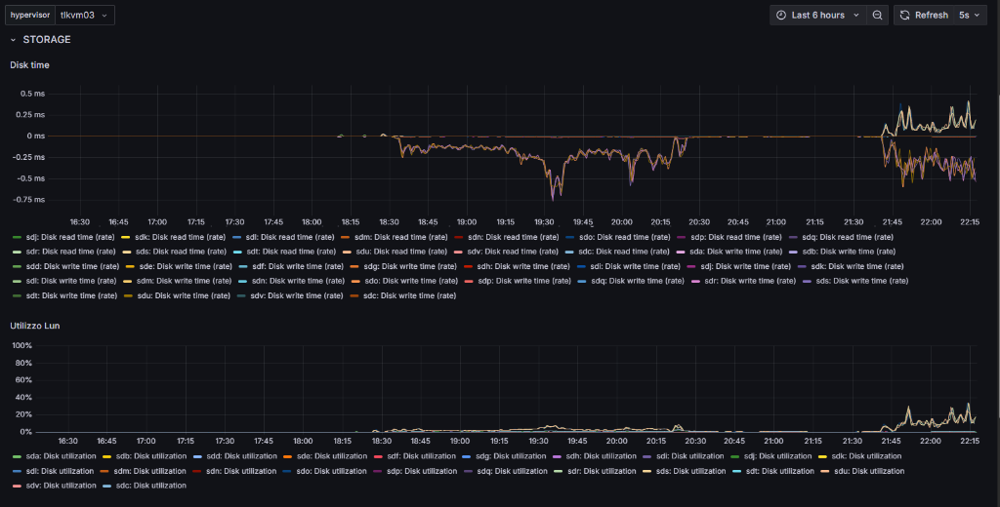

# Storage Tuning & OLTP VM Migration Report — KVM Cluster / SLES 15.7

**Report date:** July 9, 2026  
**Reference Architecture:** [KvirtIO](README.md)  
**Environment:** SLES 15.7 / Pacemaker / Multipath FC / KVM  

---

## 1. Cluster Hardware Context and Environment

The deployment was carried out on a 3-node KVM cluster with heterogeneous resources, configured to ensure High Availability (HA) and maximize I/O throughput for transactional (OLTP) workloads.

| Component | Detail / Specifications |
|---|---|
| **Node Model** | Dell PowerEdge R740 (3 physical nodes) |
| **RAM** | Heterogeneous: 2 nodes with **~740 GB** RAM, 1 node with **1.5 TB** RAM |
| **Network Connectivity** | 2 × 10 Gigabit Ethernet interfaces configured in Port Channel (LACP) |
| **Storage Connectivity** | 2 × 16 Gigabit Fibre Channel HBAs per node |
| **Storage Array** | **Dell PowerStore 1200T** |
| **Storage Configuration** | Storage distributed across **2 stretched LUNs** |
| **Hypervisor & Cluster** | KVM on SUSE Linux Enterprise Server 15.7, managed by Pacemaker |

> **Note on node heterogeneity**: The reference HLD ([KvirtIO_HLD](KvirtIO_HLD.md), Section 2) recommends homogeneous nodes to simplify live migration. This deployment represents a real-world validation with heterogeneous hardware, confirming that the KvirtIO architecture operates correctly even with RAM capacity asymmetry between nodes, provided that Pacemaker migration policies (`resource-stickiness` and negative scores) are configured to account for per-node maximum memory constraints.

---

## 2. Baseline from Previous Tests

The initial benchmarks performed on a test VM before optimizations are detailed in the companion document [report-storage-it.md](report-storage-it.md).

Those tests highlighted:
- **Single-link saturation**: Sequential throughput was limited to ~1073 MiB/s read and ~1067 MiB/s write, saturating the net bandwidth of a single 16 Gbps FC path.
- **Queuing and Latency**: At low concurrency levels, latencies were optimal (~1.1 ms), but under extreme concurrency (100 parallel processes, total queue depth of 6400 outstanding IOs), average latency rose to **~50.6 ms** due to queuing bottlenecks and non-optimized HBA drivers.

---

## 3. Storage Tuning and Optimization Interventions

To overcome single-link saturation and enable true I/O parallelization across HBAs and physical paths, two key configuration changes were applied at the host level.

### A. Multipath Optimization (`/etc/multipath/conf.d/hba.conf`)

A path aggregation and selection policy was configured to minimize service times and maximize load parallelization. The configuration file was set as follows:

```text
defaults {
    user_friendly_names yes
    path_grouping_policy multibus
    path_selector "service-time 0"
    rr_min_io_rq 1
    polling_interval 5
    no_path_retry fail
}
```

#### Directive Details

- **`path_grouping_policy multibus`**: Groups all active paths into a single "multibus" group, enabling load balancing across all physical channels simultaneously.

  > **Architectural Note — Array Access Model Compatibility**: The `multibus` policy assumes the storage array presents LUNs in **symmetric Active/Active** mode across all controllers, i.e., every physical path is equivalent in terms of latency and throughput. The **Dell PowerStore 1200T** uses an **Active/Active architecture with uniform volume auto-placement**, where LUNs are symmetrically served by all appliance nodes without controller trespassing. This confirms the correctness of the `multibus` choice. On storage arrays implementing **ALUA (Asymmetric Logical Unit Access)** with preferred and non-preferred paths (e.g., active/passive or active/optimized vs. active/non-optimized), the correct policy would be `group_by_prio` to avoid implicit LUN trespassing between controllers, which would severely degrade performance. **Anyone adopting this configuration on arrays other than PowerStore must verify their storage access model before replicating this directive.**

- **`path_selector "service-time 0"`**: Routes I/O to the path with the lowest estimated latency/service time, maximizing efficiency.

- **`rr_min_io_rq 1`**: Forces multipath path switching after a single I/O request. This distributes the load at the maximum granularity level (per-request round-robin).

- **`no_path_retry fail`**: Immediately fails I/Os upon total path loss, without waiting.

  > **Architectural Rationale**: In an environment with dual-level fencing managed by Pacemaker/SBD (as documented in the [HLD Section 4](KvirtIO_HLD.md)), the `fail` choice is deliberate. If all FC paths are lost, the node is in a state of storage isolation and must be managed by the cluster (STONITH via `fence_idrac` or self-fence via SBD/watchdog), not by multipathing. A high `no_path_retry` value (e.g., `queue` or a large retry count) would keep I/Os queued indefinitely at the kernel level, **blocking the PostgreSQL process** in an uninterruptible wait state (`D state`) and preventing Pacemaker from completing the `VirtualDomain` resource `stop` within its configured timeout. This would lead to a disorderly double failover. With `fail`, PostgreSQL immediately receives an I/O error, Pacemaker detects the resource failure, and the cluster proceeds with orderly fencing and VM restart on a healthy node within deterministic timeframes.

### B. HBA Queue Depth Increase (QLogic Driver)

To prevent hardware-level bottlenecks in the Fibre Channel driver during high-concurrency workloads, the HBA Queue Depth of the `qla2xxx` driver was set to **256** via kernel module parameter in `/etc/modprobe.d/qla2xxx.conf`:

```text
options qla2xxx ql2xmaxqdepth=256
```

This allows the kernel and the physical HBA to queue a significantly larger number of simultaneous requests to the storage array controllers before generating software-level congestion.

> **Correlation with HLD `lun_queue_depth`**: As documented in the [HLD Section 3.1](KvirtIO_HLD.md), the `lun_queue_depth` parameter at the per-device level (`/sys/block/sdX/device/queue_depth`) is the effective limit of in-flight requests per LUN/path at the SCSI mid-layer. The `ql2xmaxqdepth` parameter sets the **upper ceiling** the HBA driver is willing to accept, but the operational queue depth for each LUN is determined by the `queue_depth` value negotiated or set at the device level. In this deployment, the per-LUN `queue_depth` value was verified to be aligned with the driver configuration to prevent the per-LUN limit from negating the HBA-level increase. The Multi-LUN Striped strategy recommended by the HLD (Section 3.2) multiplies the aggregate queue across the number of LUNs in the volume group, ensuring the total available queue ($N_{\text{LUN}} \times \text{queue\_depth}$) is well above the demand generated by the VMs.

---

## 4. Post-Tuning Fio Benchmark (OLTP Simulation)

After applying the tuning parameters, a validation test was run with `fio` simulating a mixed random transactional workload (70% Read / 30% Write) with small blocks (4 KB).

> **Note:** The file size and number of processes (jobs) were slightly reduced compared to the baseline tests to avoid disk space exhaustion (ENOSPC) on the test VM.

### Command Executed

```bash
fio --name=rand_test_oltp --ioengine=libaio --rw=randrw --rwmixread=70 --bs=4k --size=1G \
    --numjobs=12 --iodepth=32 --direct=1 --time_based --runtime=60 --group_reporting
```

### Results

| Metric | Read | Write | Aggregate Total |
|---|---|---|---|
| **IOPS** | 82,300 | 35,300 | **117,600 IOPS** |
| **Bandwidth (BW)** | 321 MiB/s (337 MB/s) | 138 MiB/s (145 MB/s) | **459 MiB/s** (482 MB/s) |
| **Average Latency (`clat`)** | 3.20 ms (3,204 µs) | 3.35 ms (3,346 µs) | **~3.25 ms** |
| **99th Percentile Latency** | 6.33 ms (6,325 µs) | 6.72 ms (6,718 µs) | **~6.45 ms** |
| **99.9th Percentile Latency** | 9.50 ms (9,503 µs) | 10.55 ms (10,552 µs) | **~9.80 ms** |
| **Maximum Latency** | 24.89 ms (24,893 µs) | 26.99 ms (26,989 µs) | — |
| **Data Transferred** | 18.8 GiB | 8,275 MiB | — |

### Technical Performance Analysis

#### Little's Law Verification

With `numjobs=12` and `iodepth=32` per process, the total queue of simultaneously outstanding I/O requests is $12 \times 32 = 384$.

Applying the theoretical latency formula:

$$\text{Expected average latency} = \frac{\text{Total Queue}}{\text{Aggregate IOPS}} = \frac{384}{117{,}638 \text{ IOPS}} \approx 3.26\text{ ms}$$

The effective average latency recorded by `fio` is **~3.25 ms**. This near-exact alignment indicates that the storage array (PowerStore 1200T) and the SAN are processing requests optimally, without generating anomalous queues or spurious waits beyond those mathematically expected from the concurrency imposed by the test. In other words, **100% of the observed latency is explained by the queue depth**, not by path inefficiencies.

#### Internal Data Transfer Consistency

As further validation of data integrity:
- Read: $321 \text{ MiB/s} \times 60\text{s} \approx 18.8\text{ GiB}$ ✓
- Write: $138 \text{ MiB/s} \times 60\text{s} \approx 8{,}275\text{ MiB}$ ✓

#### Exceptionally Stable Percentiles

The 99th percentile latency stays below 7 ms for both reads and writes, while the 99.9th percentile (transactional worst-case) does not exceed 11 ms. For an OLTP database, this latency predictability ensures stable transactions and prevents query queue blocking spikes.

---

## 5. Production Monitoring of the Migrated OLTP VM

Following the encouraging results from synthetic benchmarks, a **production OLTP VM** was migrated into the KVM cluster (running the [KvirtIO](README.md) stack).

### OLTP VM Profile

| Parameter | Value |
|---|---|
| **Role** | PostgreSQL Database Node serving a Zabbix instance |
| **Application Load** | Average of **4,000 VPS** (values per second) written to the PostgreSQL DB |
| **Storage Configuration** | Hosted on **2 active stretched LUNs** on the PowerStore 1200T |
| **Execution Node** | `tlkvm03` |

### Behavioral Analysis (Dashboard Metrics)

Historical telemetry extracted from the execution host (`tlkvm03`) monitoring clearly shows storage performance across two distinct operational phases:



*Top chart: Disk Time (read/write latency per LUN) — Bottom chart: Utilization percentage per individual LUN.*

#### Phase 1: Standard Operation (Workload Startup and Execution) — *Interval ~18:30 - 20:30*

- **Disk Time (Latency)**: In the top chart (where the positive axis represents write time and the negative axis represents read time), response times are at excellent levels:
  - **Write time**: Below **0.25 ms** (average value close to 0.15 ms).
  - **Read time**: Between **-0.25 ms** and **-0.5 ms** (with rare transient spikes to -0.75 ms).
- **LUN Utilization**: In the bottom chart, the percentage utilization of each involved LUN remains below **5%**.
- *Assessment*: The applied multipath + HBA optimizations, combined with the native low latency of the PowerStore 1200T, maintain operational latencies at sub-millisecond levels while handling the frequent reads/writes required to process Zabbix's 4,000 VPS.

#### Phase 2: Forced Replication Alignment (Catch-up) — *Interval ~21:40 - 22:15*

- **Context**: During the temporary shutdown to complete the migration into the KVM cluster, the database accumulated a data lag. Upon restart, a massive data replication was forced to realign the PostgreSQL node.
- **Disk Time (Latency)**: Despite the heavy throughput increase due to concurrent synchronization, response times showed a minimal and controlled increase:
  - **Write time**: Peak at **0.4 ms**.
  - **Read time**: Peak at **-0.6 ms**.
  - Latency remained solidly below 1 millisecond even under replication stress.
- **LUN Utilization**: Per-LUN utilization peaked at **20%**.
- *Assessment*: The real-world stress test of forced replication demonstrated system resilience. LUN saturation at 20% reveals an **80% performance headroom reserve**, guaranteeing the cluster can absorb sudden load spikes without any performance degradation for end users or system watchers.

---

## 6. Architectural Conclusions

The adoption of the `multibus` multipath configuration with `service-time` selector on the Dell PowerStore 1200T array (symmetric Active/Active), combined with the HBA driver queue `ql2xmaxqdepth=256`:

1. **Eliminated single-path bottlenecks**: I/O is now efficiently distributed across all available 16 Gbit FC physical links, with mathematical confirmation (Little's Law) that observed latency is entirely explained by the imposed concurrency, with no additional overhead.
2. **Guarantees sub-millisecond latencies in production**: The PostgreSQL VM achieves average operational latencies below 0.5 ms under a typical load of 4,000 VPS.
3. **Enables fast recovery**: Alignment and forced replication processes leverage the available throughput (up to 117k IOPS measured) saturating the LUN at only 20%, keeping the end-user experience intact.
4. **Validates the KvirtIO architecture with heterogeneous nodes**: The 3-node cluster with asymmetric RAM (2×740 GB + 1×1.5 TB) operates correctly under both synthetic load and real production OLTP workloads, validating the architectural choices documented in the [HLD](KvirtIO_HLD.md) regarding storage, multipathing, fencing, and migration policies.

---

*Report generated from raw `fio` 3.35 output, Grafana telemetry from host `tlkvm03`, and technical analysis within the context of the [KvirtIO](README.md) architecture.*
